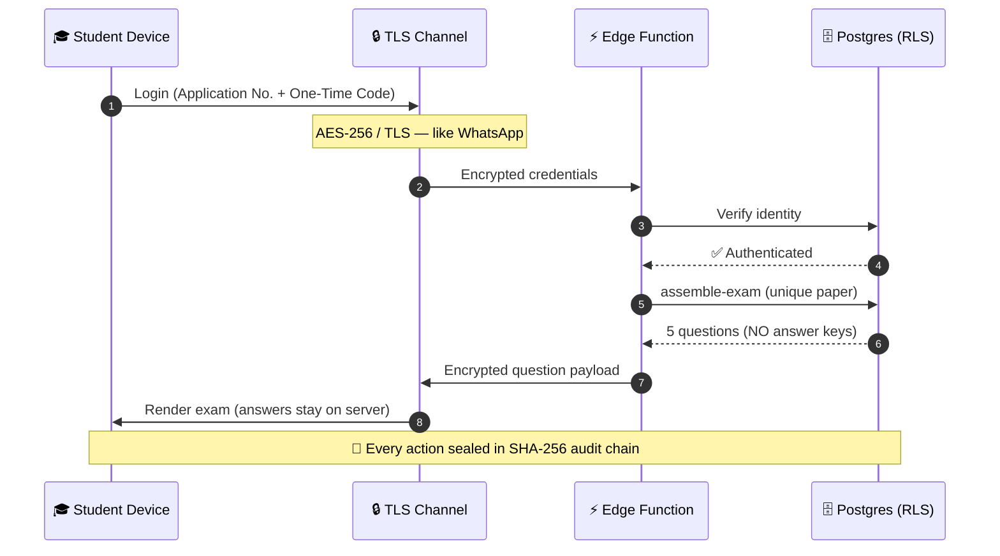

<!-- ============================================================ -->
<!--  PROJECT NEXUS · README                                      -->
<!--  Built by GREYMATTER for FAR AWAY 2026 — Examinations Theme  -->
<!-- ============================================================ -->

<div align="center">


<br/>

<a href="#"></a>

<br/>

<a href="#"></a>

<br/><br/>


<br/><br/>


<br/><br/>


</div>

<br/>

---

<div align="center">

# 🎯 The Problem We're Solving

</div>

<table>
<tr>
<td width="50%" valign="top" align="center">

### 📰 The headline every exam season

```diff
- PAPER LEAKED HOURS BEFORE EXAM
- MILLIONS OF STUDENTS RETAKE TEST
- QUESTION PAPER FOUND ON TELEGRAM
- HONEST STUDENTS PAY THE PRICE
```

Every year, leaked papers destroy the dreams of millions who studied honestly.

**The reason is simple — *a physical paper exists*.**

It's printed, transported, stored, and handled by many people. **Every step is a leak point.**

</td>
<td width="50%" valign="top" align="center">

### ⚖️ Even without leaks — unfairness

```diff
+ SHIFT 1: Easy paper → high scores
- SHIFT 2: Hard paper → low scores
! SAME EXAM. UNEQUAL OUTCOMES.
```

When different shifts get different papers, one group gets lucky, another doesn't.

**Paper luck — not ability — decides who tops the rank list.**

A topper in a hard shift can score lower than an average student in an easy shift.

</td>
</tr>
</table>

<br/>

<div align="center">

## 💡 The NEXUS Idea, in One Sentence

<a href="#"></a>

</div>

<br/>

---

<div align="center">

# 🔐 Encrypted Like WhatsApp — End-to-End, Per Session

</div>

<table>
<tr>
<td width="50%" valign="top">

### 💬 How WhatsApp protects your messages

WhatsApp uses the **Signal Protocol** for end-to-end encryption. Messages are encrypted on your device with **AES-256**, signed with cryptographic keys, and transmitted so that **even WhatsApp's own servers cannot read the content**. Only the intended recipient holds the keys to decrypt.

**Encryption + cryptographic integrity hashes** working together.

</td>
<td width="50%" valign="top">

### 🛡️ How NEXUS protects your exam

NEXUS uses the **same family of cryptography**: every connection is wrapped in **TLS** (HTTPS), session integrity is demonstrated with **AES-GCM 256-bit encryption** via the Web Crypto API, and **every action — login, answer, verification — is sealed into a SHA-256 hash chain** so tampering is mathematically detectable.

**End-to-end encryption + tamper-evident hashing.**

</td>
</tr>
</table>

<br/>



> 🎯 **The honest truth:** TLS does the actual transport encryption (Supabase provides this automatically). The login screen shows an **AES-GCM animation** to *illustrate the concept visually* for students. The SHA-256 audit chain is real and runs server-side on every event. We don't fake the crypto — we use the same primitives WhatsApp uses, applied to a different problem.

<br/>

---

<div align="center">

# 🏛️ Architecture at a Glance

```mermaid
flowchart LR
    subgraph Browser["🖥️ Browser (React + Tailwind)"]
        UI[👤 1 student's paper only<br/>🔒 No answer keys ever<br/>📷 Camera processed locally]
    end

    subgraph Edge["⚡ Supabase Edge Functions"]
        A[🧩 assemble-exam<br/>Per-student paper]
        S[✅ submit-exam<br/>Server-side scoring]
        N[⚖️ normalize-scores<br/>Cross-shift fairness]
        L[🔐 log-event<br/>SHA-256 audit chain]
    end

    subgraph DB["🗄️ Postgres (Row-Level Security)"]
        IB[(🔒 item_bank<br/>NEVER exposed)]
        AT[(📋 exam_attempts)]
        RS[(📝 responses)]
        AL[(⛓️ audit_log<br/>hash-chained)]
    end

    Browser ==>|🔒 HTTPS / TLS<br/>AES-256 like WhatsApp| Edge
    Edge ==> DB

    style IB fill:#DC2626,color:#fff,stroke:#fff,stroke-width:3px
    style AL fill:#059669,color:#fff,stroke:#fff,stroke-width:3px
    style Browser fill:#1D4ED8,color:#fff,stroke:#fff,stroke-width:3px
    style Edge fill:#0F172A,color:#fff,stroke:#fff,stroke-width:3px
    style A fill:#1E40AF,color:#fff
    style S fill:#1E40AF,color:#fff
    style N fill:#1E40AF,color:#fff
    style L fill:#1E40AF,color:#fff
```

</div>



<div align="center">

> 🔐 **The one rule that makes this secure:** the question bank, correct answers, difficulty data, and all scoring live **server-side**.<br/>The browser only ever receives one student's questions, with no answer keys. **Just like WhatsApp servers can't read your messages — our servers send students questions but never the answers.**

</div>

<br/>

---

<div align="center">

# ✨ The Two Promises

</div>

<table>
<tr>
<td width="50%" align="center" valign="top">


### 🎯 What it means

Every candidate gets a uniquely assembled paper from the server bank. The correct answers **never** reach the browser.

### 🔒 How we enforce it

```
❌ Browser cannot read item_bank (RLS)
❌ Browser cannot see correct_option
❌ Browser cannot inspect difficulty data
✅ Scoring happens entirely server-side
✅ Each paper is invisibly watermarked
```

**A leaked screenshot helps no one else.**

</td>
<td width="50%" align="center" valign="top">


### 🎯 What it means

Different students get different papers — but every paper is assembled to **equal total difficulty**, and scores are **normalized across shifts**.

### 📐 The math

```
✅ Equal-difficulty automated assembly
✅ Equipercentile normalization per shift
✅ Topper of hard shift = top percentile
✅ Topper of easy shift = top percentile
✅ Same formula NTA uses for JEE Main
```

**Paper luck never decides outcomes.**

</td>
</tr>
</table>

<br/>

---

<div align="center">

# 🎬 How a Student Experiences It

</div>

```
   ┌──────────────────────────────────────────────────────────────────┐
   │                                                                  │
   │  ① 🔐  SECURE LOGIN                                              │
   │     ──────────────                                               │
   │     Application Number + One-Time Code (expires in 90s)          │
   │     Real Supabase Auth · TLS encrypted · RLS protected           │
   │                                                                  │
   ├──────────────────────────────────────────────────────────────────┤
   │                                                                  │
   │  ② 📷  CONSENT + LIVE FACE VERIFICATION                          │
   │     ───────────────────────────────                              │
   │     Camera processed locally · nothing recorded                  │
   │     Liveness check confirms a real person                        │
   │                                                                  │
   ├──────────────────────────────────────────────────────────────────┤
   │                                                                  │
   │  ③ 📦  SECURE SESSION SEALS                                      │
   │     ────────────────────                                         │
   │     assemble-exam picks 5 unique questions                       │
   │     Numbers generated per-student · answers stay on server       │
   │     Per-candidate watermark embedded                             │
   │                                                                  │
   ├──────────────────────────────────────────────────────────────────┤
   │                                                                  │
   │  ④ 📝  EXAM IN PROGRESS                                          │
   │     ──────────────────                                           │
   │     One question at a time · autosave every selection            │
   │     Random identity re-checks · quiet integrity logging          │
   │     Every action sealed into SHA-256 audit chain                 │
   │                                                                  │
   ├──────────────────────────────────────────────────────────────────┤
   │                                                                  │
   │  ⑤ ✅  SUBMIT                                                    │
   │     ────────                                                     │
   │     Server-side scoring · audit chain finalized                  │
   │     "Results released after all shifts complete"                 │
   │                                                                  │
   ├──────────────────────────────────────────────────────────────────┤
   │                                                                  │
   │  ⑥ 📊  RESULTS (released after shift normalization)              │
   │     ─────────────────────────────────────────                    │
   │     Score · percentile · radar chart                             │
   │     Tamper-evident audit hash · full transparency                │
   │                                                                  │
   └──────────────────────────────────────────────────────────────────┘
```

<br/>

---

<div align="center">

# 🧠 How Dynamic Papers Work

*Every student. Different paper. Same difficulty. Zero coordination required.*

</div>

<table>
<tr>
<th align="center">🎯 Question Type</th>
<th align="center">✅ What's Identical</th>
<th align="center">🎲 What's Unique Per Student</th>
</tr>
<tr>
<td align="center"><b>🔢<br/>Numerical</b></td>
<td valign="top">

The **concept and formula**

```
v = a × t  (kinematics)
F = m × a  (Newton's 2nd law)
```

</td>
<td valign="top">

The **numbers** plugged in

```diff
+ Student A: a=5, t=4 → v=20 m/s
+ Student B: a=7, t=6 → v=42 m/s
+ Student C: a=3, t=9 → v=27 m/s
```

</td>
</tr>
<tr>
<td align="center"><b>💭<br/>Conceptual</b></td>
<td valign="top">

The **topic and difficulty band**

```
Topic: Binary Search Trees
Level: Mid (difficulty=0.6)
```

</td>
<td valign="top">

The **wording, angle, option order**

```diff
+ "Explain how a BST works"
+ "Compare BSTs to linked lists"
+ "When is a BST inefficient?"
```

</td>
</tr>
<tr>
<td align="center"><b>⚖️<br/>Ethical</b></td>
<td valign="top">

The **reasoning skill tested**

```
Skill: Decision under pressure
Frame: Stakeholder analysis
```

</td>
<td valign="top">

The **scenario context**

```diff
+ Scenario A: Engineering deadline
+ Scenario B: Medical triage
+ Scenario C: Resource allocation
```

</td>
</tr>
</table>

<br/>

---

<div align="center">

# 📐 The Fairness Math (Plain English)

</div>

### 1️⃣ Difficulty-balanced assembly

Every item in the bank carries a calibrated `difficulty` parameter from **0.0 (easy)** to **1.0 (hard)**, measured from real student performance. When `assemble-exam` builds a paper, it selects items so the **total difficulty is equal for every candidate**.

```
Student A: [0.3] + [0.6] + [0.4] + [0.8] + [0.5]  →  Total: 2.6
Student B: [0.5] + [0.4] + [0.7] + [0.5] + [0.5]  →  Total: 2.6
Student C: [0.4] + [0.5] + [0.6] + [0.6] + [0.5]  →  Total: 2.6
```

**Different questions. Equal challenge.**

### 2️⃣ Equipercentile normalization

After a shift closes, `normalize-scores` converts each raw score into a percentile *within that shift*:

```
percentile = (students you outscored ÷ total in shift) × 100
```

This is the same method **NTA uses for JEE Main** to handle multiple shifts. A topper in a hard shift and a topper in an easy shift both land near 100. **Mathematically removes paper luck.**

<br/>

---

<div align="center">

# 🛡️ Integrity Layer — Real vs Simulated *(Honest Disclosure)*

> *We believe judges deserve transparency. This table tells you exactly what is fully implemented vs what is demonstrated for the concept.*

</div>

| # | Protocol | Status | What's Actually Happening |
|:-:|----------|:------:|---------------------------|
| 1 | **Focus tracking** | 🟢 **Real** | `window.blur/focus` → audit log; non-intrusive banner |
| 2 | **Keystroke biometric** | 🟡 **Hybrid** | Real inter-key timing capture; deviation check is a heuristic threshold, not ML |
| 3 | **Identity re-check modal** | 🟢 **Real** | Randomized prompts; logged interaction |
| 4 | **Face verification + liveness** | 🟡 **Hybrid** | Real `getUserMedia` feed displayed live; match score is **simulated** and labelled as such in the UI. Production roadmap wires a real ML provider behind an Edge Function. *Note: we say "face verification + liveness" — not retina/iris, which requires specialized infrared hardware.* |
| 5 | **Cognitive-hash question** | 🟡 **Hybrid** | Question is real; personalization is simulated |
| 6 | **Stress monitor** | 🔵 **Simulated demo** | Clearly labelled in UI; shows a kind tip banner |
| — | **Per-candidate watermarking** | 🟢 **Real** | Unique token + option-order signature per attempt |
| — | **Response-time anomaly detection** | 🟢 **Real** | Server-side, human-reviewed |
| — | **Exposure control** | 🟢 **Real** | Low-use items preferred |
| — | **Tamper-evident audit log** | 🟢 **Real** | `sha256(prev_hash + detail + timestamp)` chain |
| — | **AES-256 / TLS encryption** | 🟢 **Real** | Same family as WhatsApp's Signal Protocol |
| — | **Server-side scoring + sealed answer keys** | 🟢 **Real** | The actual leak-prevention mechanism |
| — | **Server clock enforcement** | 🟢 **Real** | Exam window validated against `now()` server-side |

> 📦 **Sandbox / lockdown context:** in this web prototype, "sandbox" means a server-authoritative session (volatile memory, no local storage, wiped on close). True OS-level lockdown (preventing alt-tab, screenshots, app switching) requires a dedicated secure browser like **Safe Exam Browser** — documented as production roadmap, not claimed as implemented.

<br/>

---

<div align="center">

# 🗂️ Repository Structure

</div>

```bash
nexus/
├── 📁 src/
│   ├── 📁 components/      # Reusable UI (cards, badges, modals, banners)
│   ├── 📁 views/           # Login · Loading · Exam · Results
│   ├── 📁 lib/             # Supabase client, crypto helpers, timers
│   ├── 📁 security/        # focus tracker, keystroke, identity, biometric
│   └── 📁 styles/          # Tailwind config + tokens
├── 📁 supabase/
│   ├── 📁 migrations/      # SQL schema + RLS policies
│   └── 📁 functions/
│       ├── 🧩 assemble-exam/      # server-side paper assembly
│       ├── ✅ submit-exam/         # server-side scoring
│       ├── ⚖️ normalize-scores/    # per-shift equipercentile normalization
│       ├── 🔐 log-event/           # SHA-256 hash-chained audit append
│       └── 🔍 analyze-integrity/   # post-exam anomaly review
├── 📄 .env.example         # safe template (no secrets)
├── 📄 .gitignore           # .env, node_modules, dist
└── 📄 README.md            # you are here ✨
```

<br/>

---

<div align="center">

# 🚀 Getting Started

</div>

### ⚙️ Prerequisites


### 1️⃣ Clone & install

```bash
git clone https://github.com/devsatyamm/nexus.git
cd nexus
npm install
```

### 2️⃣ Set up Supabase

```bash
# Create a free project at supabase.com, then:
cp .env.example .env
# Fill in VITE_SUPABASE_URL and VITE_SUPABASE_ANON_KEY
# (anon key is safe to expose — RLS protects everything)

# Apply the schema:
supabase db push

# Deploy edge functions:
supabase functions deploy assemble-exam
supabase functions deploy submit-exam
supabase functions deploy normalize-scores
supabase functions deploy log-event

# Set the service_role secret (NEVER commit this):
supabase secrets set SUPABASE_SERVICE_ROLE_KEY=<your-service-role-key>
```

### 3️⃣ Run the frontend

```bash
npm run dev
# → open http://localhost:5173
```

<br/>

> 🔒 **GitHub-safety check:** before pushing, run `git status` and confirm `.env` is **not** staged.
> The anon key in `.env.example` is designed to be public (RLS protects it).
> The `service_role` key lives **only** as a Supabase secret — never in code, never in git history.

<br/>

---

<div align="center">

# 🎨 Design Philosophy

</div>

<table>
<tr>
<td width="50%" valign="top">

### ✅ What this UI looks like

```diff
+ 🤍 Off-white surfaces, soft shadows, whitespace
+ 🔵 Deep navy as the only accent
+ ✍️ DM Sans everywhere
+ 🔢 JetBrains Mono only for hashes/IDs/logs
+ 🪶 Gentle CSS transitions
+ ♿ WCAG 2.1 AA accessible
+ 📱 Mobile-first responsive
+ 🎯 One clear primary action per screen
```

</td>
<td width="50%" valign="top">

### ❌ What it deliberately doesn't look like

```diff
- 💚 Hacker terminal with green-on-black
- ⚠️ Aggressive flashing warnings
- 📊 Cluttered surveillance dashboard
- 🤖 Jargon-heavy engineer-speak
- 👁️ Intimidating proctoring theater
```

Many users are first-time, non-technical students.

**This must feel like a trustworthy university portal.**

</td>
</tr>
</table>

<br/>

---

<div align="center">

# 🛣️ Roadmap

</div>

```
✅ Phase 1 — Core exam            Auth · per-student assembly · server-side scoring
✅ Phase 2 — Fairness engine      Difficulty balancing · cross-shift normalization
🚧 Phase 3 — Integrity layer      Proctoring · anomaly detection · human review queue
🔭 Phase 4 — Platform polish      Admin dashboard · item authoring · accommodations
🔭 Future  — Production hardening Real ML face verification · Safe Exam Browser · iris hardware
```

<br/>

---

<div align="center">

# 🌸 Theme Alignment — FAR AWAY 2026 · Examinations

> *"Reimagine the future of examinations with secure, fair and intelligent solutions."*

<br/>

<table>
<tr>
<td align="center" width="33%" valign="top">

### 🔒 Secure

```
✅ Server-side answer keys
✅ Sealed item bank (RLS)
✅ AES-256 / TLS encryption
✅ SHA-256 audit chain
✅ Watermarked papers
```

*Just like WhatsApp — your data isn't readable mid-transit.*

</td>
<td align="center" width="33%" valign="top">

### ⚖️ Fair

```
✅ Equal-difficulty assembly
✅ Equipercentile normalization
✅ Accessibility & accommodations
✅ Human-reviewed flags
✅ Results after all shifts close
```

*Paper luck mathematically eliminated.*

</td>
<td align="center" width="33%" valign="top">

### 🧠 Intelligent

```
✅ Dynamic per-student papers
✅ Calibrated difficulty parameters
✅ Response-time anomaly checks
✅ Adaptive integrity signals
✅ Tamper-evident logging
```

*Smarter than just watching harder.*

</td>
</tr>
</table>

</div>

<br/>

---

<div align="center">

# 👤 Built By

<br/>


<br/><br/>

### Satyam Mishra
<sub>Engineering · Architecture · Design</sub>

<br/>

<sub>📬 If you're a judge or reviewer: please see the **Real vs Simulated** table above for an honest breakdown of what's implemented vs roadmap.<br/>We chose transparency over polish — we believe a fair exam system has to start with honest builders.</sub>

</div>

<br/>

---

<div align="center">

# 📜 License


<sub>Released under the MIT License — free to learn from, fork, and improve.</sub>

</div>

<br/>

<div align="center">

<a href="#"></a>

<br/>


</div>
